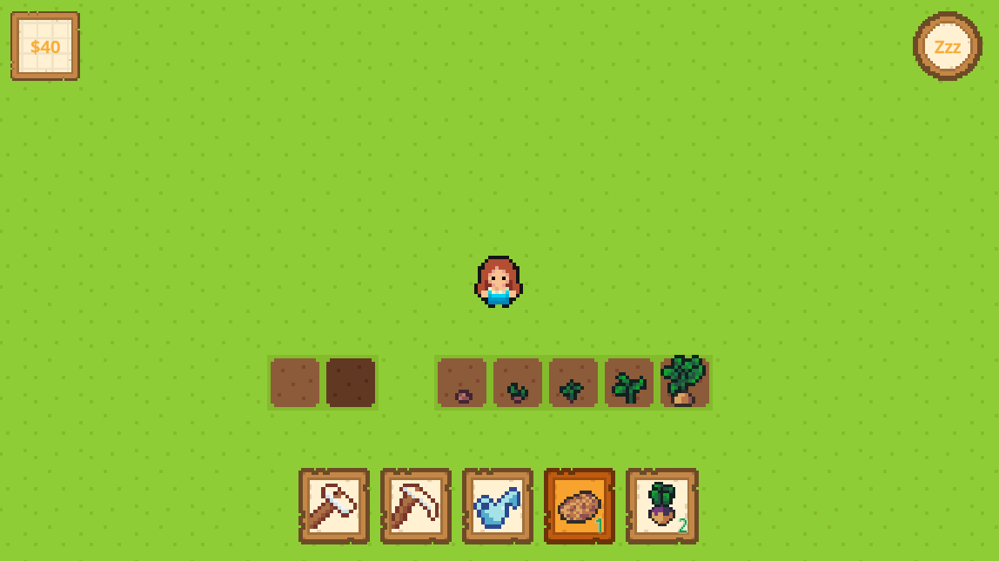

## RC Godot Farming Game

## Resources

- [Zenva Godot Farming RPG Course](https://academy.zenva.com/course/godot-farm-rpg-course/)  
  Loosely followed this tutorial as a starting point for building a complete game.
  Modified the farming tool assets, UI, and most of the code structure.

- [Godot Documentation – Creating a 2D Game](https://docs.godotengine.org/en/latest/getting_started/first_2d_game/index.html)  
  Used as a reference for learning core 2D game concepts in Godot.

### Assets

- **Crops, icons, and growth images**  
  Creator: [josehzz](https://opengameart.org/users/josehzz)  
  Source: [Farming crops 16x16](https://opengameart.org/content/farming-crops-16x16)  
  License: CC0

- **Character sprites**  
  Creator: [Fleurman](https://opengameart.org/users/fleurman)  
  Source: [Tiny Characters Set](https://opengameart.org/content/tiny-characters-set)  
  License: CC0

- **Button and display backgrounds**  
  Creator: [Kenney](https://www.kenney.nl/)  
  Source: [UI Pack – Pixel Adventure](https://www.kenney.nl/assets/ui-pack-pixel-adventure)  
  License: CC0

- **Menu icons**  
  Creator: [Crusenho](https://crusenho.itch.io/)  
  Source: [Bookstyles Complete UI Pack](https://crusenho.itch.io/complete-ui-book-styles-pack)  
  License: Free to use, share, distribute, copy, adapt, remix, and transform  
  *(Assets recolored to match the game’s tone.)*

- **Farming tools**  
  Created by me for this project.

---

Made with <3 at [The Recurse Center](https://recurse.com).  
This project is for educational purposes only.

